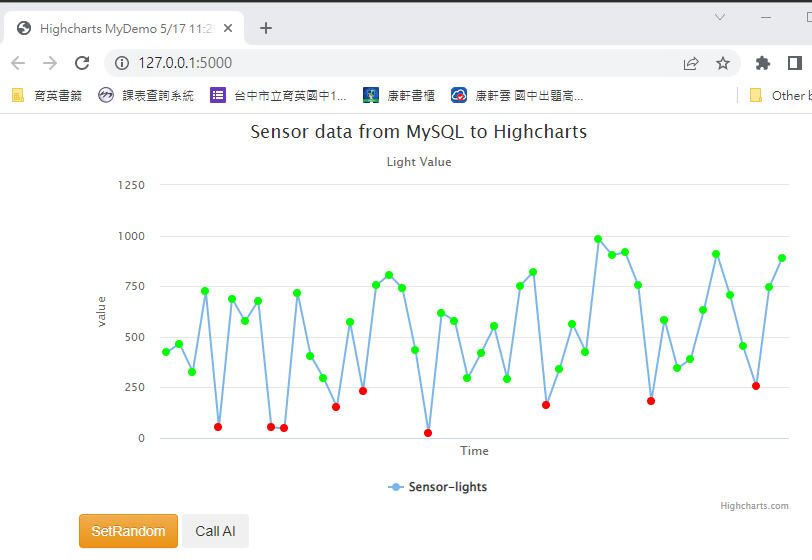

# AIoT Github

##### Author : Minlan    
## Lecture 15: IoT Flask Web (deploy to heroku)  
### step0: Setup Environment    
*github, heroku account setup    
*download HeidiSQL, VS code   

### step 1 : Clone this github  
*clone https://github.com/huanchen1107/aiot0530-start-no-token.git (complete)  
*delete .git管理者, folder ./aiot0529下面的資料都搬上一層  
*git remote to new repository aiot0601  

### step 2 : install some package


```python
pip install gunicorn   Flask==2.0.1 Jinja2==3.0.1 
psycopg2 sklearn pandas  numpy 
```

### step 3: add an heroku postgredb
* If you want to test locally, you need to install the following packages. (That is the same thing in the Requirements.txt)

* register heroku account
* go to dashboard
* new an app
* go to resource and add-on an Heroku postgredb

### step 4: login to heroku pstgredb using HeidiSQL


```sql
myserver ="<fill-in-Heroku-Postgredb-DB-sever>"
myuser="<fill-in-Heroku-Postgredb-DB-user>"
mypassword="<fill-in-Heroku-Postgredb-DB-pwd>"
mydb="<fill-in-Heroku-Postgredb-DB-db>"

```
### step 5: import postgredb (in db/postgre.db)


### step 6: setting db in app.py


```sql
myserver ="<fill-in-Heroku-Postgredb-DB-sever>"
myuser="<fill-in-Heroku-Postgredb-DB-user>"
mypassword="<fill-in-Heroku-Postgredb-DB-pwd>"
mydb="<fill-in-Heroku-Postgredb-DB-db>"

```
### step 7: testing locally by running python app.py




### step 8: deploy to github (new private github repositoy)

delete .git and git remote add origin master github.com/xxxxx


### step 9: Heroku deploy from github

### step 10: Complete

Sample link 1:
https://awinlab-aiot.herokuapp.com/

Sample link 2: 
https://aiot0529.herokuapp.com/


